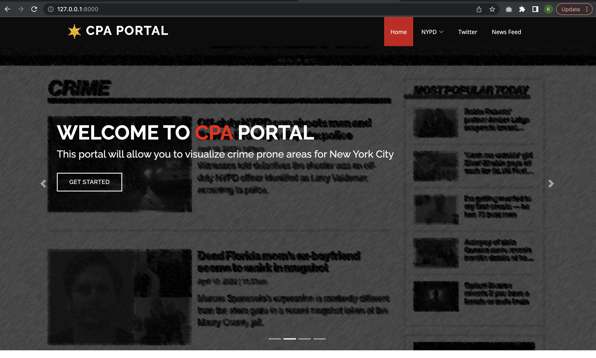

# Crime Prone Areas Visualization

<p>
  
</p>


Crime Prone Areas is a web based application that visualizes crime prone areas in the city New York

## Table of Content

1. [ Features. ](#features)
2. [ Installation. ](#install)
3. [Images. ](#images)
4. [ Tech Stack. ](#techstack)
----
## Features!
- Identify the crime prone areas by analyzing the historic data from emergency services
- Help the authorities continually identify areas prone to crimes and policing-related incidents
- Visualize latest activities in New York using tweets and News feed
----

<a name='install'> </a>

## Installation

<a name = 'req'> </a>

### Requirements

- Python 3.3+ or Python 2.7
- macOS or Linux (Windows not officially supported, but might work)

### Installation
- Clone the repo 
- Download required datasets from this [link](https://drive.google.com/drive/folders/1PjDzTVfriOqzUdym2EDxACkdDCJXWE2O?usp=sharing)
- Move the download folder inside the finalyearproject folder in the cloned repo
- Create a virtual environment (recommended)

```
python3 -m venv /path/to/new/virtual/environment
```
- Install required python packages from the requirements file
```
pip install -r requirements.txt
```
- m cd into finalyearproject folder and run the following command
```
python3 manage.py runserver
```
----

<a name='images'> </a>
## Images
<p float="left">
  
  
  
  
  
  
  
  
  
</p>

----
<a name = 'techstack'> </a>

## Tech Stack
- Python 
- Django
- HTML CSS
- Javascript